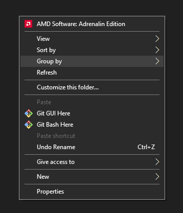
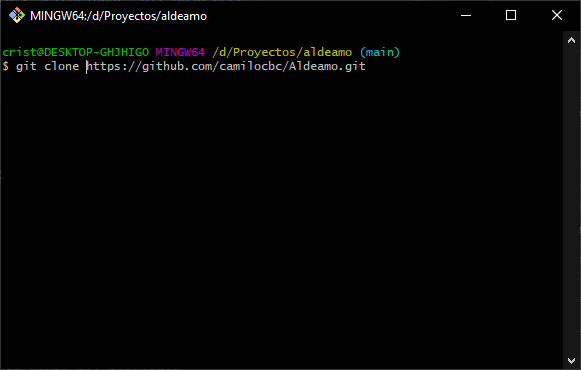
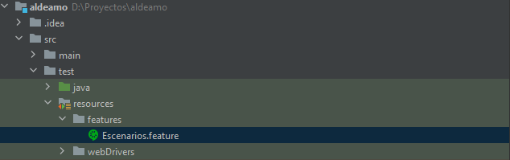
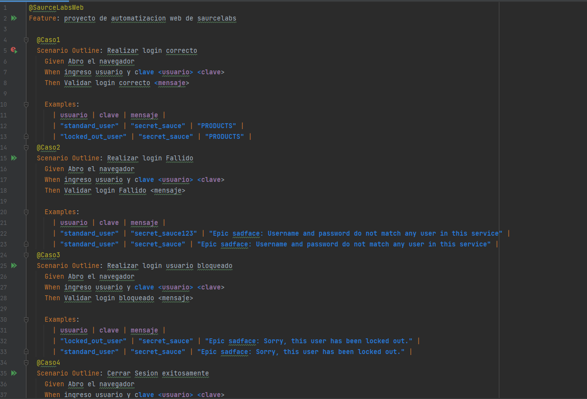
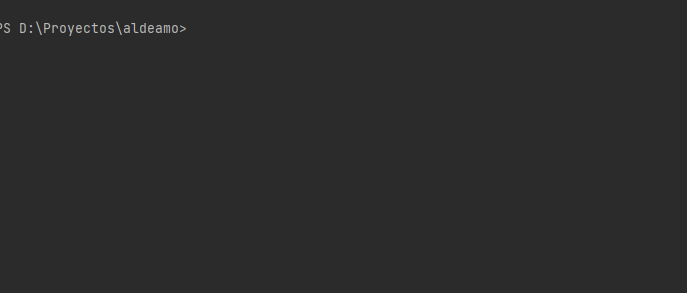
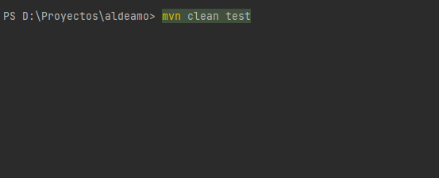
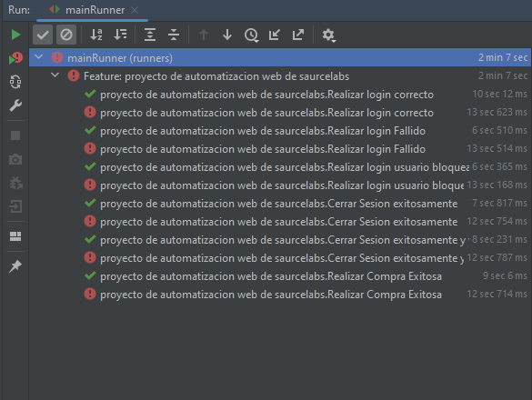
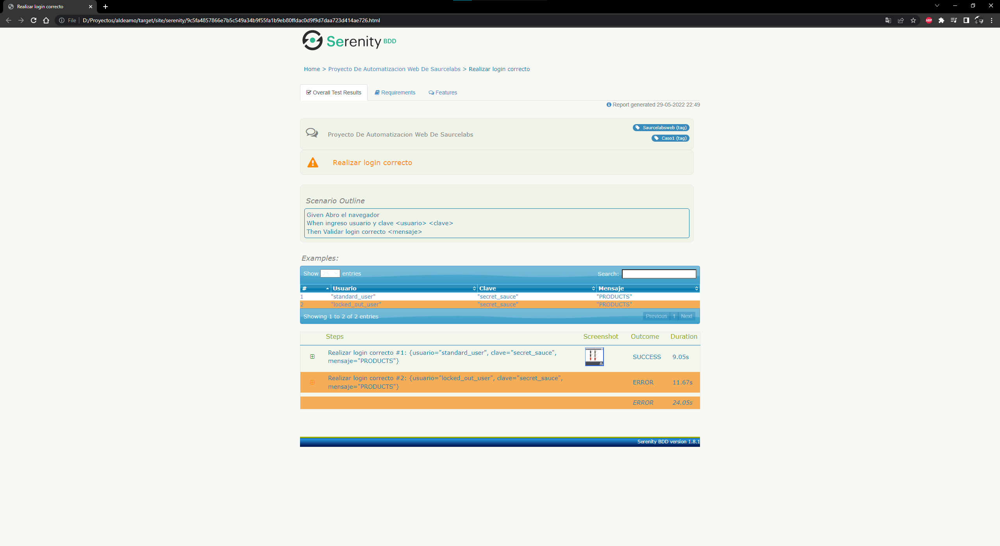

# Test Aldeamo

_Realizar la prueba tecnica solicitada por la empresa aldeamo con el fin de participar en la seleccion del puesto de IngenieroQA_


### Pre-requisitos 📋

_Que cosas necesitas para instalar el software y como instalarlas_

```
Instalar Software:

    - Java
    - Intellij
    - Maven
    - Git
```
```
Instalar Herramientas de Desarrollo y ejecucion:

    - Dependencias del POM
    - Cucumber
    - ChromeDriver
    - GeckoDriver
```
### Instalacion 📋

1. Dar click derecho en la carpeta a descargar el proyecto y seleccionar "Git Bash Here".



2. Ingresar el comando "git clone https://github.com/camilocbc/Aldeamo.git" y dar Enter.


## Ejecutando las pruebas ⚙️

_Como Ejecutar la prueba Automatizada._
1. ingresar a el archivo data.featura en la ruta "aldeamo/src/test/resources/features".

2. Ingresar los datos de la prueba


3. Abrir la consola con la tecla windows + R y digitamos cmd


4. Se nos abrira la consola donde digitaremos el comando cd "ruta del proyecto"



5. Digitar el comando "mvn clean test" para ejecutar la automatizacion.


6. Validamos que la prueba exitosa.



7. Revisamos las Evidencias en la ruta "aldeamo/target/site/serenity"


## Construido con 🛠️

* [SerenityBDD](https://serenity-bdd.info/)
* [Maven](https://maven.apache.org/)
* [Cucumber](https://cucumber.io/)

## Autores ✒️


* **Cristan Camilo Buitrago** - *Trabajo Inicial* - [camilocbc](https://github.com/camilocbc)
* **Cristan Camilo Buitrago** - *Documentación* - [camilocbc](https://github.com/camilocbc)


